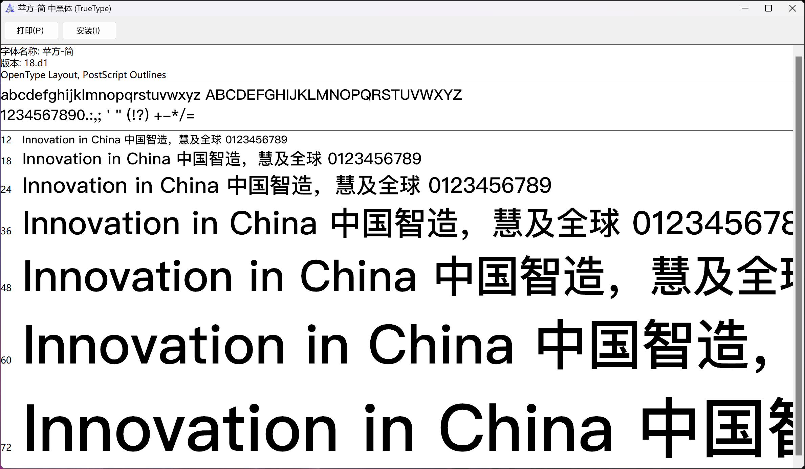
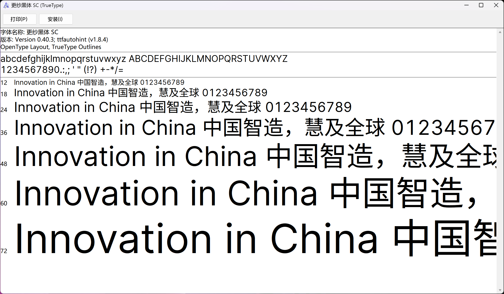
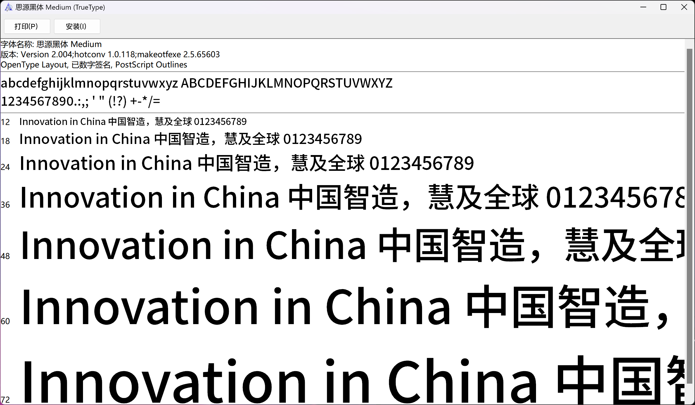
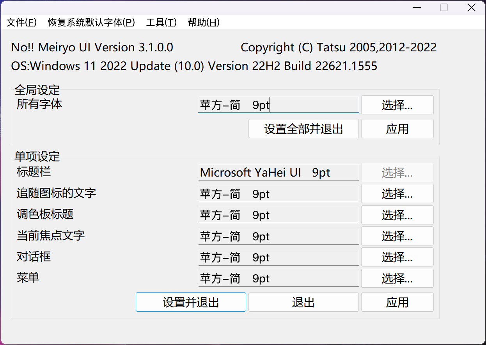
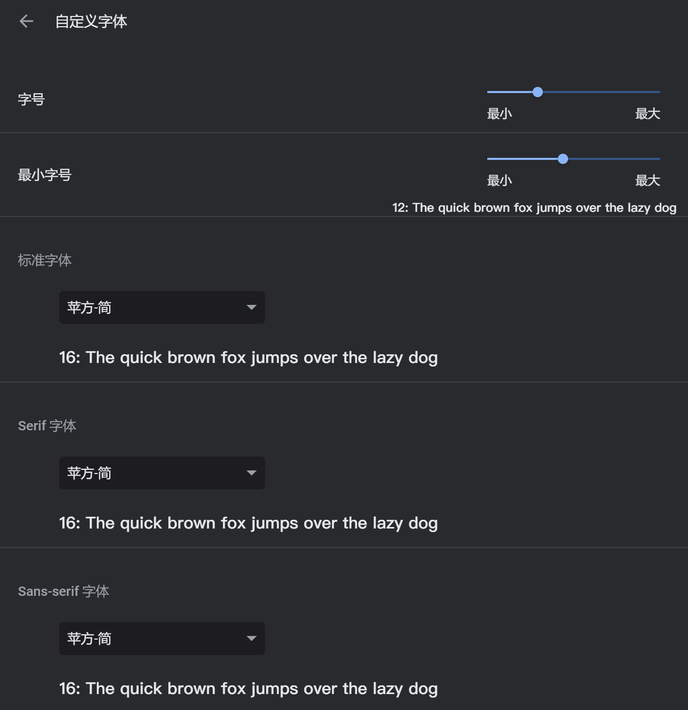
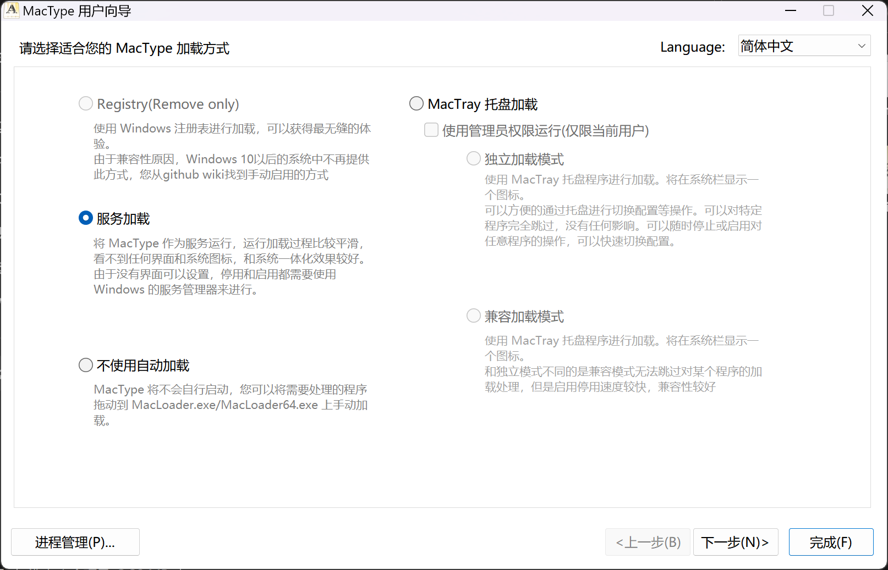
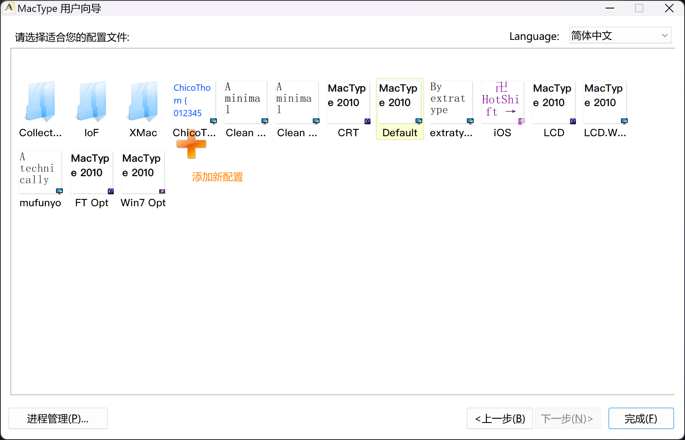
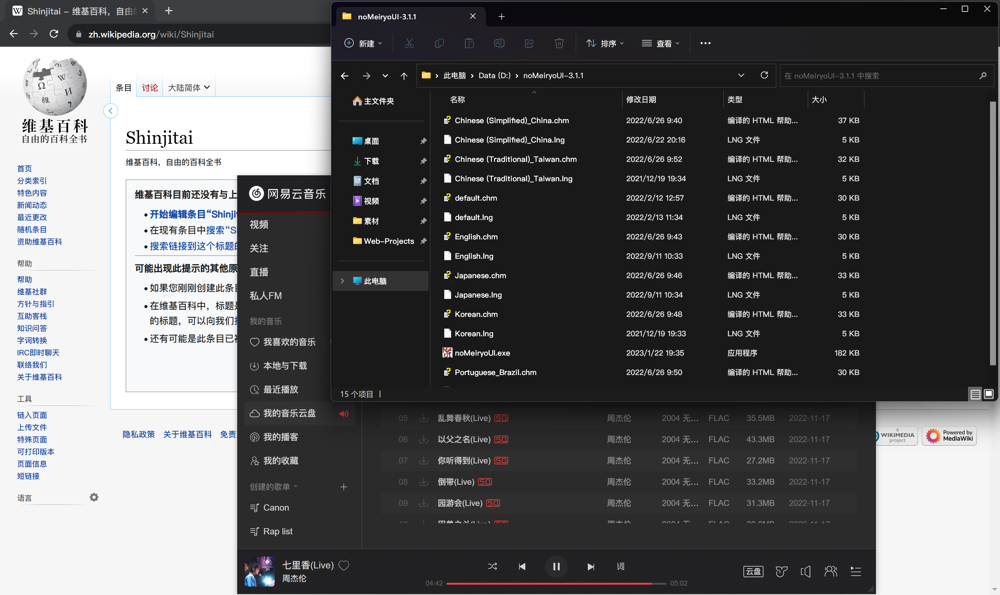

## 前言

相信有很多人和我一样，看腻了<code>Microsoft YaHei</code>字体，又或者是对原生<code>Windows</code>系统字体渲染不满意。当然解决第二个问题，最直接的方法就是换一部高分辨率屏幕。我自己的屏幕分辨率是<code>4k</code>，在我使用中，字体渲染并不比<code>MacOS</code>的差。

但是如果你想暂时的解决上面的两种问题，可以尝试我下面文章中的方法。

## 字体

我目前使用的是来自 [DSRKafuU](https://blog.dsrkafuu.net/post/2020/extract-sf-pingfang/#) 提取的<code>MacOS 苹方字体</code>，对比其他字体之下，我感觉更顺眼的一款字体。这点可以根据每个人的喜好来挑选字体，用到的方法都是一样的~

安装方法：下载你喜欢的字体，打开字体文件之后，点击左上角安装即可~

下面推荐了三款字体，苹方字体、更纱黑体、思源字体。

### 苹方字体

这里不提供直链，打开链接到作者博客文章底部下载即可。

下载链接：[DSRKafuU](https://blog.dsrkafuu.net/post/2020/extract-sf-pingfang/#)

### 更纱字体

下载链接：[GitHub Releases](https://github.com/be5invis/Sarasa-Gothic/releases)

### 思源字体

下载链接：[GitHub Releases](https://github.com/adobe-fonts/source-han-sans/releases)

## 工具

### noMeiryoUI

> **What No!! Meiryo UI can ?** 
> This program sets the system font setting on Windows 8.1/10/11. 
> In other words, this program can change fonts in Win32/WinForms program's title bar, menu, message box, icon name (also Explorer's file and folder name).

以上引用官方的解释。

简单来说，这个工具可以帮助你改变<code>Windows 8.1/10/11</code>的系统字体。

下载链接：[GitHub Releases](https://github.com/Tatsu-syo/noMeiryoUI/releases)

设置步骤非常简单，我们安装好之后，打开<code>noMeiryoUI.exe</code>。

全局设定 - 选择（选择我们之前安装好的字体，这里我安装的苹方） - 设置全部并退出。

需要注意：

-   <code>Meiryo UI</code>对忽略系统字体设置的程序没有影响；
-   <code>在 Windows11 22H2</code>以上的版本中，不可以改变标题栏字体；

另外对于浏览器等软件可能需要单独设置，例如<code>Chrome</code>需要在<code>设置-外观-自定义字体</code>更换为你使用的字体。

### MacType

如果您的屏幕分辨率较低，仅更换字体可能无法达到最佳效果，这时可以使用<code>MacType</code>来优化字体的渲染效果。它可以模拟<code>Mac OS X</code>中的子像素渲染技术，从而使字体更清晰、锐利、易读。

如果你的屏幕已经达到 4k 及以上的超高分辨率，<code>MacType</code>的效果可能并不太明显，可以尝试开启缩放<code>200%</code>。但在低分辨率屏幕上，使用 MacType 可以显著提高字体的显示效果，建议尝试。

第一步：

下载安装：[GitHub Releases](https://github.com/snowie2000/mactype/releases)

第二步：

打开软件后，可以选择右上角的<code>Language</code>选择合适你的语言。

这里的加载方式，推荐服务模式，就如它下面的解释一样，选择后进行下一步。

这里一般选择<code>Defeat</code>就够用了，也可以自己创建配置，选择后点击完成即可。

## 结尾

最后，放上最终的效果图。我在这里只使用了<code>noMeiryoUI</code>

